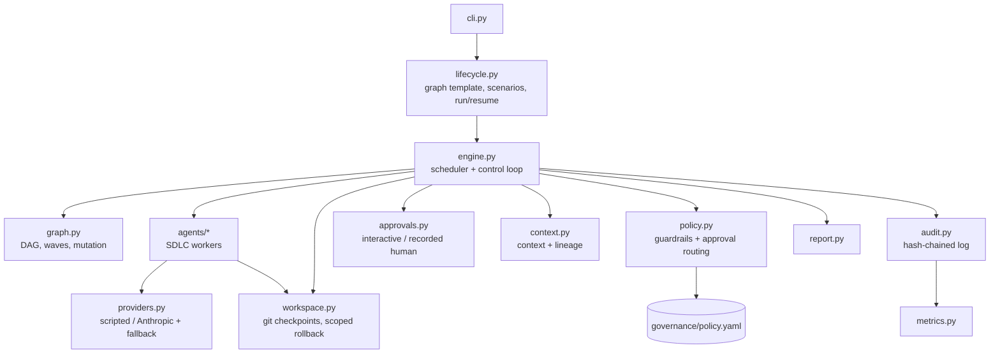
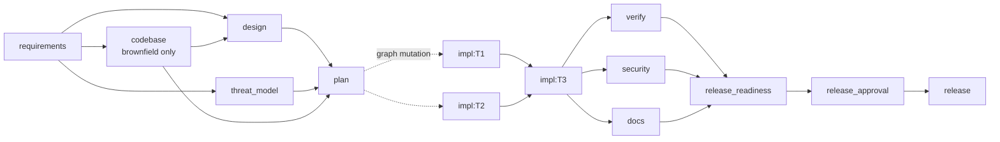
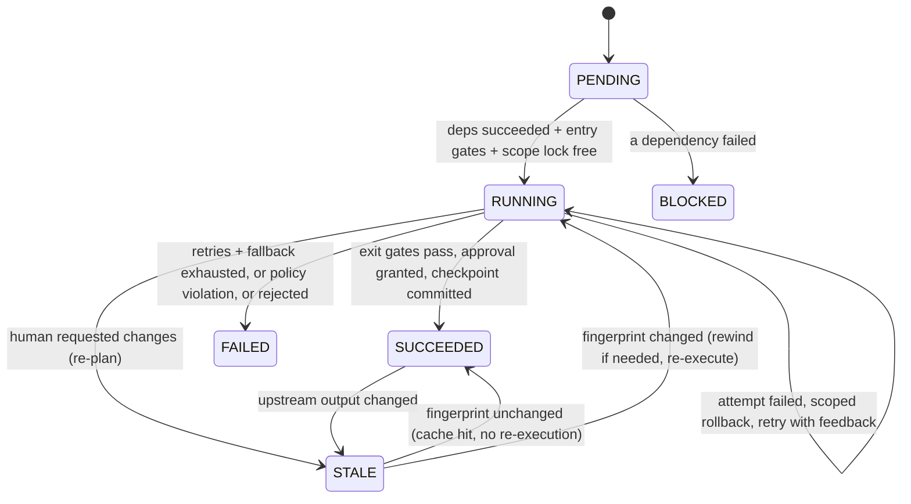

# Architecture

## 1. Goals and principles

The system turns a requirement into a released, reviewable outcome while keeping autonomy **bounded**:

1. **Agents propose, policy disposes, humans decide.** Agents never commit, approve or mutate shared state.
   The engine applies policy and routes high-impact decisions to people.
2. **Everything is a checkpoint.** Every successful change is a git commit; every failed attempt is rolled
   back to the last one. A run can stop at any point and resume from persisted state.
3. **Evidence over assertion.** Each stage has exit gates that *prove* its output (targeted tests, full suite,
   API contract vs. design, security scan, readiness checklist, post-release smoke test).
4. **Deterministic by default.** Agent content comes from a pluggable provider. The default replays reviewed
   responses so runs are reproducible and the orchestration itself can be evaluated; Claude can be plugged in
   as the primary provider with the same governance.

## 2. Components

| Component | Responsibility | Key design choice |
|---|---|---|
| `engine.py` | Schedules ready nodes, runs gates/attempts/approvals, applies results, re-plans, safe-stops | All shared state mutated on the main thread only; workers return values. Parallel yet deterministic, and every transition is persistable. |
| `graph.py` | Explicit dependency graph: validation (cycles, unknown deps), parallel waves, critical path, runtime mutation | The planner's output *is* a graph mutation; the graph is re-validated after every change. |
| `agents/` | One agent per SDLC activity | Agents receive a read-only snapshot of only the context keys they declare (least privilege) and a workspace restricted to their write scope. |
| `policy.py` + `policy.yaml` | Change control, security and compliance rules; decides which actions need a human | Policy is data, not code, and is itself a protected path agents can never modify. |
| `approvals.py` | Human checkpoints | Interactive terminal prompt, or recorded decisions attributed to a named person. No recorded decision means **reject** (silence is not consent). |
| `context.py` | Cross-stage blackboard with provenance (producer, run, input keys, hash) and a decision log | `lineage()` answers "why was this decided?" by walking values and decisions back to the requirement. |
| `workspace.py` | Git repository per run | A node's uncommitted edits are confined to its scope, so a failed attempt is rolled back without touching parallel siblings. |
| `audit.py` | Append-only JSONL, each record carries the SHA-256 of the previous one | Tampering or deletion anywhere breaks verification (`verify-audit`). |
| `metrics.py` | Success rate, retry/rollback frequency, fallbacks, re-plans, MTTR, stage and end-to-end latency | Derived *from* the audit log, so metrics can always be recomputed and never disagree with the record. |
| `providers.py` | Generation backends and fallback chain | Agents own process and validation; providers only generate content. Governance is identical for LLM and replay. |

## 3. Orchestration model

### 3.1 The lifecycle graph

The static skeleton is built in `lifecycle.lifecycle_graph`; implementation tasks are added at runtime.

* **Sequential paths**: requirements → design → plan → … → release.
* **Parallel paths with synchronisation**: `design ∥ threat_model (∥ codebase)` join at `plan`; independent
  implementation tasks run concurrently; `verify ∥ security ∥ docs` join at `release_readiness`.
* **Dynamic sub-graph**: `plan` returns validated tasks as a graph mutation. The engine adds, updates or
  removes `impl:*` nodes and rewires the join nodes to depend on all of them.

### 3.2 Node lifecycle

### 3.3 Execution of one node (worker thread)

1. **Entry gates**: declared inputs exist in the context (wildcards must match ≥ 1); the node's write scope
   is clean. A failed entry gate fails the node immediately, since retrying cannot create missing inputs.
2. **Attempt loop** (bounded by `RetryPolicy.max_attempts`, default from policy):
   agent runs → injected-fault hook (demo only) → **policy check of the change set** → **exit gates**.
   On failure: the node's scope is rolled back (`rollback.performed`), the error is appended to the
   feedback passed to the next attempt, and a retry is scheduled.
3. **Fallback**: if attempts are exhausted and the node declares a `fallback_agent`, it runs once. Provider-level
   fallback (LLM down → replay) happens transparently inside `FallbackProvider` and is audited.
4. **Approval routing**: the policy classifies the change set (schema migration, new dependency, public API
   change, deletion) and combines it with node risk and mandatory checkpoints. Any reason means a human
   decides: *approve*, *reject* (→ safe-stop) or *request changes* (→ re-plan).
5. **Checkpoint**: the node's scope is committed; the commit id is stored on the node.

Policy violations are **never retried**: they discard the node's changes and trigger a safe-stop.

### 3.4 Scheduling and synchronisation (main thread)

* A node is ready when all dependencies are `SUCCEEDED`. Ready nodes are submitted up to
  `autonomy.max_parallel_nodes`.
* **Resource locks**: two nodes whose write scopes overlap are never co-scheduled (the planner also
  serialises such tasks at plan time and records the decision).
* Completion handling publishes outputs to the context, records decisions, applies graph mutations,
  detects changed outputs and persists `state.json` atomically (write-then-rename).

### 3.5 Re-planning when upstream outputs change

Every node stores an **input fingerprint**: a hash of its agent, parameters, write scope, the output hashes of
its dependencies and the hashes of its declared context inputs.

* When a node re-runs and its output hash changes, its succeeded dependents become `STALE`.
* When a human requests changes, the amendment is published to the context and the target node (normally
  `requirements`) plus all descendants become `STALE`.
* A `STALE` node whose fingerprint is unchanged is a **cache hit**: marked succeeded without re-execution.
  Implementation tasks fingerprint their *task definition*, not the whole spec: the plan is the contract
  between spec and code, so a spec change only re-runs a task if the planner changed that task.
* A code task that must genuinely re-run on a different base is **rewound**: the workspace is reset to
  before its checkpoint, and every node whose checkpoint was discarded becomes `STALE` with its cache
  invalidated. Tasks removed by a re-plan are rewound the same way.

The ambiguous scenario shows this: a release-review change request re-runs requirements → design (new
sign-off) → threat model → plan. The planner adds one task, five tasks are cache hits, and verification,
security and docs re-run on the new graph.

### 3.6 Safe-stop, rollback and resume

| Trigger | Effect |
|---|---|
| Policy violation / rejected approval | Mode `safe_stop`: no new nodes scheduled; running nodes finish; uncommitted changes discarded; status `SAFE_STOPPED` |
| Node failure after retries + fallback | Mode `failed`: same draining and cleanup; descendants `BLOCKED`; status `FAILED` |
| `orchestrator stop <run>` (STOP file) or Ctrl-C | Safe-stop at the next scheduling point |
| Release smoke test fails | Promotion reverted (previous release restored if one existed); node fails |

`resume` reloads the graph, node states and context from `state.json`, resets interrupted or failed nodes, and
continues. The audit chain continues across sessions.

## 4. Governance

`governance/policy.yaml` sets the autonomy boundary:

* **Autonomy**: nodes above `max_auto_approve_risk: low` need a human; max parallelism.
* **Mandatory checkpoints**: `clarification`, `design_signoff`, `release` can never be auto-approved.
* **High-impact actions** detected from the diff: `schema_migration`, `new_dependency`, `deletion`.
* **Change control**: protected paths (`orchestrator/**`, `governance/**`, `scenarios/**`, `.git/**`, `.github/**`),
  per-node write scopes, max files and lines per change, path-traversal rejection.
* **Security**: secret patterns (cloud keys, private keys, live API keys, credential-named assignments),
  forbidden code (`eval`, `exec`, `pickle.load`, `shell=True`, `verify=False`, f-string SQL, unsafe YAML),
  dependency allowlist.
* **Compliance**: no PII columns (`client_ip`, `email`, `user_agent`, …) in migration DDL; every
  product-code task must name the tests that prove it.

## 5. Key decisions (orchestrator)

| Decision | Why | Alternatives rejected |
|---|---|---|
| Explicit DAG with runtime mutation, not a linear chain or free-form agent loop | Dependencies, parallelism, gates and re-planning must be inspectable and testable; free-form loops cannot be audited or bounded | Linear pipeline (no parallelism or re-plan); autonomous agent loop (unbounded, non-reproducible) |
| Main-thread-only state mutation | Parallel workers with deterministic, persistable state transitions and no locking of shared structures | Shared mutable context with locks (race-prone, hard to persist consistently) |
| Git as the workspace substrate | Checkpoints, diffs for policy classification, scoped and full rollback, and human-readable history for free | Copy-on-write directories (no diff/history); in-memory file maps (not inspectable) |
| Scope-disjoint parallelism + scoped rollback | Lets siblings run concurrently and fail independently | Global workspace lock (serialises everything); per-node clones + merge (merge conflicts become a new failure mode) |
| Fingerprint caching with early cut-off | Re-planning re-executes only what changed, cheap and explainable | Re-run everything downstream (slow, re-asks humans needlessly) |
| Deterministic scripted provider by default | Reviewers can reproduce every run and the tests can assert on it; the governance layer is exercised identically | LLM-only (non-deterministic, needs keys, untestable in CI) |
| Recorded approvals default to reject | Unattended runs cannot silently widen autonomy | Default approve (unsafe); fail hard on missing decision (same effect, less informative) |
| Metrics derived from the audit log | Single source of truth; recomputable | Separate counters (can drift from the record) |

## 6. Requirement traceability

| Assignment requirement | Where it is implemented | Evidence |
|---|---|---|
| Requirement understanding, ambiguity | `agents/requirements.py` (vague-term detection + provider clarifications, human answers, amendments) | Ambiguous run: 3 vague terms detected, 4 clarifications decided |
| Task decomposition with dependencies | `agents/planner.py` (validation, scope serialisation, waves, critical path) | `artifacts/plan.md` in every run |
| Codebase reasoning (brownfield) | `agents/codebase.py` (AST import graph, routes, tables, impacted modules, blast radius, tests to re-run) | `sample-runs/2-brownfield/artifacts/codebase-analysis.md` |
| Dependency graph with entry/exit gates | `graph.py`, `gates.py` | Engine tests; `gate.*` audit events |
| Sequential + parallel paths with synchronisation | `engine._schedule`, join nodes | Timeline in reports; `test_disjoint_scopes_run_in_parallel…` |
| Cross-stage context and decision lineage | `context.py` | "Lineage of the release decision" in reports; `orchestrator lineage` |
| Human approval for high-impact actions | `policy.approval_reasons`, `approvals.py` | "Human checkpoints" table in reports |
| Bounded retries, fallback, rollback, safe-stop | `engine._execute`, `providers.FallbackProvider`, `workspace.discard/reset_to`, `engine._finish` | Brownfield B4 retry; `fault-*` sample runs |
| Policy guardrails (security, compliance, change control) | `policy.py`, `governance/policy.yaml` | `test_policy.py`; security-violation run |
| Audit-grade observability | `audit.py` (hash chain), `report.py` | `verify-audit`; tamper tests |
| Reliability metrics | `metrics.py` | `metrics.json`, `orchestrator metrics` |
| Dynamic re-planning under governance | `engine._replan`, `_apply_mutation`, fingerprints | Ambiguous run: change request → A6 added, A1-A5 cached, design re-signed |
| Controlled autonomy | Policy autonomy limits + mandatory checkpoints + protected paths | 6-9 human decisions per run; default-reject |
| Production-quality outputs | `shortener/`, `tests/shortener/`, generated docs | 88 product tests, API contract gate, security scan |
