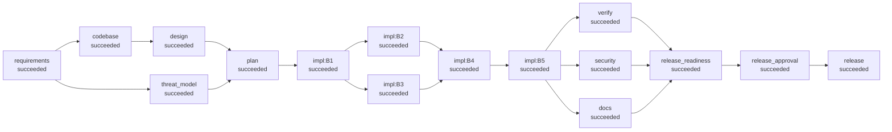

# Run report: brownfield (brownfield)

- **Run id:** `20260930-091235-brownfield-96af`
- **Status:** **succeeded**
- **Provider chain:** scripted
- **Faults injected:** none
- **End-to-end latency:** 6.091 s

## Requirement (as given)

```text
CHANGE REQUEST CR-17 (product) + BUG-101 (support)

CR-17: Marketing wants analytics per short link: total clicks, clicks per day,
top referrers and unique visitors, available from the management API. We must
not store anything that identifies a person (legal says no raw IP addresses).

BUG-101: "Expired links still count clicks." Customer reported that a campaign
link that expired last week keeps showing new clicks in the dashboard even
though visitors get a 410 page. The counter must only move on successful
redirects.

Constraints: existing API responses must not change (clients depend on them);
the existing database must be upgraded in place on deploy.
```

## Normalised spec

**Goal:** Per-link click analytics without storing personal data, and clicks counted only on successful redirects

**Flags:** []  |  **Vague terms detected:** []

**Functional**

- Each successful redirect records a click event (timestamp, referrer host, pseudonymous visitor id)
- GET /api/v1/links/{code}/stats returns total_clicks, unique_visitors, clicks_by_day (30 days), top_referrers (5)
- BUG-101: expired links return 410 without incrementing click_count or recording events
- Deleting a link deletes its click events

**Acceptance criteria**

- Regression test for BUG-101 fails before the fix and passes after it
- Stats endpoint returns correct aggregates for a known sequence of clicks; 404 for unknown codes
- Migration applies once on an existing v1 database and is a no-op on restart
- Existing v1 test-suite passes unchanged
- Security scan shows no high findings; no PII columns in migrations

**Assumptions / clarifications**

- Unique visitors need a stable identity but raw IPs are forbidden. Use a salted hash of IP+user-agent, or drop unique visitors? => salted-hash
- How long must click events be retained? => unbounded-documented

**Out of scope**

- Retention / purge of click events (tracked as follow-up)
- Dashboard UI

## Orchestration graph (final)



Parallel waves: `[['requirements'], ['codebase', 'threat_model'], ['design'], ['plan'], ['impl:B1'], ['impl:B2', 'impl:B3'], ['impl:B4'], ['impl:B5'], ['docs', 'security', 'verify'], ['release_readiness'], ['release_approval'], ['release']]`

Critical path of implementation tasks: `['B1', 'B3', 'B4', 'B5']`

### Task decomposition

| Task | Title | Depends on | Scope | Risk | Proof (tests) |
|---|---|---|---|---|---|
| B1 | Schema v2 migration (click_events) | - | shortener/db.py | high | tests/shortener/test_persistence.py |
| B2 | Regression test for BUG-101 (test-first) | B1 | tests/shortener/test_bug101_regression.py | low |  |
| B3 | Analytics module | B1 | shortener/analytics.py, shortener/config.py, tests/shortener/test_analytics.py | medium | tests/shortener/test_analytics.py |
| B4 | Fix BUG-101 and record clicks on successful redirects | B2, B3 | shortener/link_service.py | medium | tests/shortener/test_bug101_regression.py, tests/shortener/test_link_service.py |
| B5 | Stats endpoint and version 1.1.0 | B4 | shortener/app.py, shortener/schemas.py, shortener/__init__.py, tests/shortener/test_stats_api.py | medium | tests/shortener/test_stats_api.py, tests/shortener/test_api.py |

## Execution timeline

| t+s | Event | Node | Detail |
|---|---|---|---|
|   0.00 | `run.started` |  |  |
|   0.00 | `node.started` | requirements |  |
|   0.01 | `approval.requested` | requirements | - Unique visitors need a stable identity but raw IPs are forbidden. Use a salted hash of IP+user-agent, or drop unique visitors? (default: salted-hash) - How l… |
|   0.01 | `approval.decided` | requirements | answer by mounika.veeranki (recorded): Hash with a secret salt; retention policy is a follow-up with legal. |
|   0.01 | `node.succeeded` | requirements | spec with 5 acceptance criteria; 2 clarifications |
|   0.01 | `node.started` | codebase |  |
|   0.01 | `node.started` | threat_model |  |
|   0.03 | `node.succeeded` | codebase | 12 modules, 6 routes, 4 impacted |
|   0.03 | `node.started` | design |  |
|   0.15 | `node.succeeded` | threat_model | 4 threats identified, 1 residual |
|   0.15 | `approval.requested` | design | 7 endpoints, 3 ADRs  files: ['docs/adr/ADR-004.md', 'docs/adr/ADR-005.md', 'docs/adr/ADR-006.md', 'docs/design/brownfield.md'] new files: ['docs/adr/ADR-004.md… |
|   0.15 | `approval.decided` | design | approve by mounika.veeranki (recorded): Append-only events + read-time aggregation is right at this scale. ON DELETE CASCADE ok. |
|   0.28 | `node.succeeded` | design | 7 endpoints, 3 ADRs |
|   0.28 | `node.started` | plan |  |
|   0.28 | `node.succeeded` | plan | 5 tasks, 4 waves |
|   0.28 | `graph.mutated` | plan | added=['impl:B1', 'impl:B2', 'impl:B3', 'impl:B4', 'impl:B5'] updated=[] removed=[] |
|   0.29 | `node.started` | impl:B1 |  |
|   0.63 | `approval.requested` | impl:B1 | B1: 1 files  files: ['shortener/db.py']  shortener/db.py \| 17 +++++++++++++++++  1 file changed, 17 insertions(+)  detected actions: ['schema_migration'] |
|   0.63 | `approval.decided` | impl:B1 | approve by mounika.veeranki (recorded): Migration 2 is additive (new table + index), no PII columns, runs in a transaction. |
|   0.74 | `node.succeeded` | impl:B1 | B1: 1 files |
|   0.75 | `node.started` | impl:B2 |  |
|   0.75 | `node.started` | impl:B3 |  |
|   0.90 | `node.succeeded` | impl:B2 | B2: 1 files |
|   1.09 | `approval.requested` | impl:B3 | B3: 3 files  files: ['shortener/config.py', 'shortener/analytics.py', 'tests/shortener/test_analytics.py']  shortener/config.py \| 9 ++++++++-  1 file changed,… |
|   1.09 | `approval.decided` | impl:B3 | approve by mounika.veeranki (recorded): Only hashed visitor ids and referrer hosts persisted. Salt not hardcoded. |
|   1.21 | `node.succeeded` | impl:B3 | B3: 3 files |
|   1.22 | `node.started` | impl:B4 |  |
|   2.09 | `attempt.failed` | impl:B4 | GateFailure: gate 'targeted_tests_pass' failed: targeted tests failed: F.....                                                                   [100%] ========… |
|   2.10 | `rollback.performed` | impl:B4 | attempt 1 failed |
|   2.10 | `retry.scheduled` | impl:B4 |  |
|   2.86 | `approval.requested` | impl:B4 | B4: 1 files  files: ['shortener/link_service.py']  shortener/link_service.py \| 27 +++++++++++++++++++++++----  1 file changed, 23 insertions(+), 4 deletions(-… |
|   2.86 | `approval.decided` | impl:B4 | approve by mounika.veeranki (recorded): Expiry checked before any side effect; regression test now green. |
|   3.01 | `node.succeeded` | impl:B4 | B4: 1 files |
|   3.01 | `node.started` | impl:B5 |  |
|   3.89 | `approval.requested` | impl:B5 | B5: 4 files  files: ['shortener/__init__.py', 'shortener/app.py', 'shortener/schemas.py', 'tests/shortener/test_stats_api.py']  shortener/__init__.py \|  2 +- … |
|   3.89 | `approval.decided` | impl:B5 | approve by mounika.veeranki (recorded): New endpoint is additive; existing responses unchanged. |
|   4.03 | `node.succeeded` | impl:B5 | B5: 4 files |
|   4.04 | `node.started` | docs |  |
|   4.04 | `node.started` | security |  |
|   4.04 | `node.started` | verify |  |
|   4.09 | `node.succeeded` | security | findings {'high': 0, 'medium': 0, 'low': 0} |
|   4.64 | `node.succeeded` | docs | API reference for 7 endpoints; changelog 1.1.0 |
|   5.54 | `node.succeeded` | verify | 53 tests passed, 0 failed |
|   5.55 | `node.started` | release_readiness |  |
|   5.55 | `node.succeeded` | release_readiness | [PASS] all_tasks_implemented: 5 tasks [PASS] tests_green: 53 passed, 0 failed [PASS] api_contract: missing=[] [PASS] no_high_security_findings: {'high': 0, 'me… |
|   5.56 | `node.started` | release_approval |  |
|   5.56 | `approval.requested` | release_approval | [PASS] all_tasks_implemented: 5 tasks [PASS] tests_green: 53 passed, 0 failed [PASS] api_contract: missing=[] [PASS] no_high_security_findings: {'high': 0, 'me… |
|   5.56 | `approval.decided` | release_approval | approve by mounika.veeranki (recorded): BUG-101 regression test is green; existing contract unchanged. Ship 1.1.0. |
|   5.56 | `node.succeeded` | release_approval | [PASS] all_tasks_implemented: 5 tasks [PASS] tests_green: 53 passed, 0 failed [PASS] api_contract: missing=[] [PASS] no_high_security_findings: {'high': 0, 'me… |
|   5.57 | `node.started` | release |  |
|   6.08 | `node.succeeded` | release | released 1.1.0 (2a00bf3bd5) |
|   6.09 | `run.finished` |  | status=succeeded |

## Human checkpoints

| Checkpoint | Node | # | Decision | Approver | Comment |
|---|---|---|---|---|---|
| clarification | requirements | 1 | **answer** | mounika.veeranki (recorded) | Hash with a secret salt; retention policy is a follow-up with legal. |
| design_signoff | design | 1 | **approve** | mounika.veeranki (recorded) | Append-only events + read-time aggregation is right at this scale. ON DELETE CASCADE ok. |
| change_review | impl:B1 | 1 | **approve** | mounika.veeranki (recorded) | Migration 2 is additive (new table + index), no PII columns, runs in a transaction. |
| change_review | impl:B3 | 2 | **approve** | mounika.veeranki (recorded) | Only hashed visitor ids and referrer hosts persisted. Salt not hardcoded. |
| change_review | impl:B4 | 3 | **approve** | mounika.veeranki (recorded) | Expiry checked before any side effect; regression test now green. |
| change_review | impl:B5 | 4 | **approve** | mounika.veeranki (recorded) | New endpoint is additive; existing responses unchanged. |
| release | release_approval | 1 | **approve** | mounika.veeranki (recorded) | BUG-101 regression test is green; existing contract unchanged. Ship 1.1.0. |

## Decisions and lineage

- **clarify:visitor-identity** (human:mounika.veeranki (recorded), requirements): Unique visitors need a stable identity but raw IPs are forbidden. Use a salted hash of IP+user-agent, or drop unique visitors? -> salted-hash
- **clarify:retention** (human:mounika.veeranki (recorded), requirements): How long must click events be retained? -> unbounded-documented
- **spec:normalised** (agent, requirements): normalised requirement into 4 functional reqs, 5 acceptance criteria, flags=[]
- **codebase:impact** (agent, codebase): impacted ['shortener.app', 'shortener.db', 'shortener.errors', 'shortener.link_service']; blast radius ['shortener.__main__', 'shortener.repository', 'shortener.validation']
- **threats:assessed** (agent, threat_model): 4 threats, 1 residual
- **ADR-004** (agent, design): Append-only click events aggregated at read time: Store one row per successful redirect; compute stats with GROUP BY on request.
- **ADR-005** (agent, design): Pseudonymous visitor identity: visitor_id = first 16 hex chars of SHA-256(secret salt \| IP \| user-agent); referrer stored as host only.
- **ADR-006** (agent, design): Fix BUG-101 test-first, before wiring analytics: Write the regression test as its own task, then fix resolve() ordering, then add events.
- **plan:decomposition** (agent, plan): 5 tasks in 4 waves; critical path ['B1', 'B3', 'B4', 'B5']
- **impl:B1** (agent, impl:B1): Schema v2 migration (click_events) (1 files)
- **impl:B2** (agent, impl:B2): Regression test for BUG-101 (test-first) (1 files)
- **impl:B3** (agent, impl:B3): Analytics module (3 files)
- **impl:B4** (agent, impl:B4): Fix BUG-101 and record clicks on successful redirects (1 files)
- **impl:B5** (agent, impl:B5): Stats endpoint and version 1.1.0 (4 files)
- **security:scan** (agent, security): findings {'high': 0, 'medium': 0, 'low': 0}
- **verify:result** (agent, verify): 53 passed / 0 failed; contract missing=[]
- **release:readiness** (agent, release_readiness): ready=True version=1.1.0
- **release:promoted** (agent, release): promoted 2a00bf3bd5 to release

Lineage of the release decision:

```text
- decision release:readiness by agent @ release_readiness: ready=True version=1.1.0
  - verification (from verify run 1, hash a1387ad978f04e8f)
    - design (from design run 1, hash 47cd54c5a977b506)
      - spec (from requirements run 1, hash b35ebb9a194a175a)
        - requirement (from human:product-owner run 1, hash 4aa1c58cd8eb721d)
        - amendments (from engine run 0, hash 4f53cda18c2baa0c)
        - clarification_answers (from requirements run 1, hash da61035b8b636f09)
      - codebase (from codebase run 1, hash ad02197cfded9b7b)
  - security (from security run 1, hash b5fb0dbf5a562fca)
  - docs (from docs run 1, hash 6fd7e5e3fdea3344)
    - plan (from plan run 1, hash 667614936c21bede)
      - threats (from threat_model run 1, hash f17cfa7916553aed)
```

## Validation

- Tests: 53 passed, 0 failed (1.5 s)
- API contract: missing=[], undeclared=[]
- Security findings: {'high': 0, 'medium': 0, 'low': 0}
- Residual threats: ['T5']

| Readiness check | Result | Detail |
|---|---|---|
| all_tasks_implemented | PASS | 5 tasks |
| tests_green | PASS | 53 passed, 0 failed |
| api_contract | PASS | missing=[] |
| no_high_security_findings | PASS | {'high': 0, 'medium': 0, 'low': 0} |
| docs_generated | PASS | docs/API.md |
| version_bumped | PASS | 1.0.0 -> 1.1.0 |
| no_rejected_checkpoints | PASS | 6 checkpoint decisions so far |

## Reliability metrics

| Metric | Value |
|---|---|
| status | succeeded |
| end_to_end_latency_s | 6.091 |
| nodes_total | 16 |
| nodes_succeeded | 16 |
| nodes_failed | 0 |
| node_success_rate | 1.0 |
| attempts_total | 17 |
| attempt_success_rate | 0.941 |
| retries | 1 |
| retry_frequency | 0.059 |
| rollbacks | 1 |
| fallbacks | 0 |
| policy_violations | 0 |
| replans | 0 |
| approvals | 7 |
| approval_wait_s | 0.0 |
| incidents_recovered | 1 |
| incidents_unrecovered | 0 |
| mttr_s | 0.915 |
| stage_latency_s | {'design': 0.383, 'docs': 0.598, 'implement': 3.878, 'plan': 0.005, 'release': 0.525, 'requirements': 0.023, 'verify': 1.558} |

## Workspace commits (checkpoints)

```text
b8d44feba4 baseline: empty workspace
a799a2e15a baseline: project scaffold (pytest config)
418fedbdec baseline: copied from /home/claude/agentic-url-shortener/runs/20260930-091230-greenfield-ebd5/release
01da20c3a0 [threat_model] 4 threats identified, 1 residual
869580bc4c [design] 7 endpoints, 3 ADRs
f27ce3c4b8 [impl:B1] B1: 1 files
f06252ca81 [impl:B2] B2: 1 files
dbcb7b20e5 [impl:B3] B3: 3 files
0c01e7675d [impl:B4] B4: 1 files
fb66d782bc [impl:B5] B5: 4 files
2a00bf3bd5 [docs] API reference for 7 endpoints; changelog 1.1.0
```

Audit trail: `audit.jsonl` (hash-chained). Artifacts: `artifacts/`. Released tree: `release/`.
