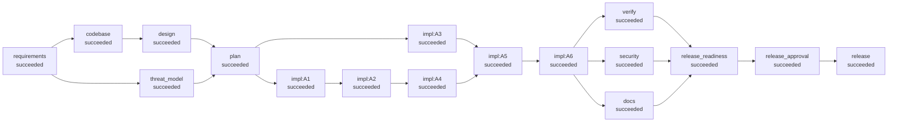

# Run report: ambiguous (ambiguous)

- **Run id:** `20260929-182938-ambiguous-e997`
- **Status:** **succeeded**
- **Provider chain:** scripted
- **Faults injected:** none
- **End-to-end latency:** 7.687 s

## Requirement (as given)

```text
From: Head of Product
Subject: shortener going public

We're opening the shortener to the public next month. Please make it safe for
public use and more robust against abuse. We can't afford to become a phishing
tool or to fall over the first time someone scripts against us.
```

## Normalised spec

**Goal:** Harden the public-facing shortener against malicious destinations and automated abuse without changing behaviour for legitimate clients

**Flags:** ['create_rate_limit', 'redirect_rate_limit', 'url_safety']  |  **Vague terms detected:** ['public use', 'robust', 'safe']

**Functional**

- Reject destinations that are unsafe to publish behind our domain with 422 UnsafeUrlError
- Block private/loopback/link-local/reserved IP literals, internal hostnames (localhost, *.local, *.internal), URLs with embedded credentials, our own domain (redirect loops) and an operator-configured domain blocklist
- Per-client token-bucket rate limit on link creation; 429 with Retry-After when exceeded
- [amendment 1] Per-client rate limit on redirects (default 300/min, configurable, 0 disables); limited requests return 429 and are not counted as clicks

**Acceptance criteria**

- Every unsafe-destination class has a test proving rejection and at least one legitimate URL per class still passes
- Existing v1.1 test-suite passes unchanged
- No high-severity security findings
- Creating more than the configured number of links per minute from one client returns 429 with Retry-After
- More than the configured redirects per minute from one client return 429 and do not increment click_count

**Assumptions / clarifications**

- 'Safe for public use' - which abuse classes are in scope for launch? => destinations-and-creation-flooding
- What creation rate is acceptable per client before throttling? => 30 per minute, burst 30, configurable (0 disables)
- Is per-instance in-memory rate-limit state acceptable for launch, or is a shared store (Redis) required? => in-memory-per-instance
- The requirement says 'robust' without a measurable criterion. What does it mean here? => abuse controls fail closed (reject) and never affect resolving existing links

**Out of scope**

- Authentication / API keys (separate initiative)
- Reputation feeds (Safe Browsing) - requires network calls and a vendor decision

## Orchestration graph (final)



Parallel waves: `[['requirements'], ['codebase', 'threat_model'], ['design'], ['plan'], ['impl:A1', 'impl:A3'], ['impl:A2'], ['impl:A4'], ['impl:A5'], ['impl:A6'], ['docs', 'security', 'verify'], ['release_readiness'], ['release_approval'], ['release']]`

Critical path of implementation tasks: `['A1', 'A2', 'A4', 'A5', 'A6']`

### Task decomposition

| Task | Title | Depends on | Scope | Risk | Proof (tests) |
|---|---|---|---|---|---|
| A1 | Abuse-control settings and error types | - | shortener/config.py, shortener/errors.py, tests/shortener/test_config_models.py | low | tests/shortener/test_config_models.py |
| A3 | Token-bucket rate limiter | - | shortener/ratelimit.py, tests/shortener/test_ratelimit.py | low | tests/shortener/test_ratelimit.py |
| A2 | Destination safety policy | A1 | shortener/safety.py, tests/shortener/test_safety.py | medium | tests/shortener/test_safety.py |
| A4 | Enforce destination safety in the service layer | A2 | shortener/link_service.py, tests/shortener/test_link_service.py | medium | tests/shortener/test_link_service.py |
| A5 | Wire creation rate limit and safety into the API (v1.2.0) | A3, A4 | shortener/app.py, shortener/__init__.py, tests/shortener/test_api_safety.py | medium | tests/shortener/test_api_safety.py, tests/shortener/test_api.py |
| A6 | Per-client redirect rate limit | A5 | shortener/app.py, shortener/config.py, tests/shortener/test_redirect_ratelimit.py | medium | tests/shortener/test_redirect_ratelimit.py, tests/shortener/test_stats_api.py |

## Execution timeline

| t+s | Event | Node | Detail |
|---|---|---|---|
|   0.00 | `run.started` |  |  |
|   0.00 | `node.started` | requirements |  |
|   0.00 | `approval.requested` | requirements | - 'Safe for public use' - which abuse classes are in scope for launch? (default: destinations-and-creation-flooding) - What creation rate is acceptable per cli… |
|   0.00 | `approval.decided` | requirements | answer by avinash.kanna (recorded): Single instance at launch, so in-memory is fine; revisit before we scale out. |
|   0.00 | `node.succeeded` | requirements | spec with 4 acceptance criteria; 4 clarifications |
|   0.01 | `node.started` | codebase |  |
|   0.01 | `node.started` | threat_model |  |
|   0.02 | `node.succeeded` | codebase | 13 modules, 7 routes, 5 impacted |
|   0.02 | `node.started` | design |  |
|   0.11 | `node.succeeded` | threat_model | 5 threats identified, 1 residual |
|   0.11 | `approval.requested` | design | 7 endpoints, 2 ADRs  files: ['docs/adr/ADR-007.md', 'docs/adr/ADR-008.md', 'docs/design/ambiguous.md'] new files: ['docs/adr/ADR-007.md', 'docs/adr/ADR-008.md'… |
|   0.11 | `approval.decided` | design | approve by avinash.kanna (recorded): Syntactic checks only is the right call; no network calls in the request path. |
|   0.19 | `node.succeeded` | design | 7 endpoints, 2 ADRs |
|   0.20 | `node.started` | plan |  |
|   0.20 | `node.succeeded` | plan | 5 tasks, 4 waves |
|   0.20 | `graph.mutated` | plan | added=['impl:A1', 'impl:A3', 'impl:A2', 'impl:A4', 'impl:A5'] updated=[] removed=[] |
|   0.21 | `node.started` | impl:A1 |  |
|   0.21 | `node.started` | impl:A3 |  |
|   0.60 | `node.succeeded` | impl:A3 | A3: 2 files |
|   0.71 | `node.succeeded` | impl:A1 | A1: 3 files |
|   0.72 | `node.started` | impl:A2 |  |
|   1.01 | `approval.requested` | impl:A2 | A2: 2 files  files: ['shortener/safety.py', 'tests/shortener/test_safety.py'] new files: ['shortener/safety.py', 'tests/shortener/test_safety.py'] detected act… |
|   1.01 | `approval.decided` | impl:A2 | approve by avinash.kanna (recorded): Blocklist uses label-boundary suffix matching; cloud metadata IP covered. |
|   1.09 | `node.succeeded` | impl:A2 | A2: 2 files |
|   1.10 | `node.started` | impl:A4 |  |
|   1.40 | `approval.requested` | impl:A4 | A4: 2 files  files: ['shortener/link_service.py', 'tests/shortener/test_link_service.py']  shortener/link_service.py            \| 4 ++++  tests/shortener/test… |
|   1.40 | `approval.decided` | impl:A4 | approve by avinash.kanna (recorded): Safety check runs after syntax validation, before any write. |
|   1.49 | `node.succeeded` | impl:A4 | A4: 2 files |
|   1.49 | `node.started` | impl:A5 |  |
|   2.50 | `approval.requested` | impl:A5 | A5: 3 files  files: ['shortener/__init__.py', 'shortener/app.py', 'tests/shortener/test_api_safety.py']  shortener/__init__.py \|  2 +-  shortener/app.py      … |
|   2.50 | `approval.decided` | impl:A5 | approve by avinash.kanna (recorded): Client key is the peer address, not X-Forwarded-For. Good. |
|   2.59 | `node.succeeded` | impl:A5 | A5: 3 files |
|   2.60 | `node.started` | docs |  |
|   2.60 | `node.started` | security |  |
|   2.60 | `node.started` | verify |  |
|   2.65 | `node.succeeded` | security | findings {'high': 0, 'medium': 0, 'low': 0} |
|   3.10 | `node.succeeded` | docs | API reference for 7 endpoints; changelog 1.2.0 |
|   4.20 | `node.succeeded` | verify | 85 tests passed, 0 failed |
|   4.20 | `node.started` | release_readiness |  |
|   4.21 | `node.succeeded` | release_readiness | [PASS] all_tasks_implemented: 5 tasks [PASS] tests_green: 85 passed, 0 failed [PASS] api_contract: missing=[] [PASS] no_high_security_findings: {'high': 0, 'me… |
|   4.21 | `node.started` | release_approval |  |
|   4.21 | `approval.requested` | release_approval | [PASS] all_tasks_implemented: 5 tasks [PASS] tests_green: 85 passed, 0 failed [PASS] api_contract: missing=[] [PASS] no_high_security_findings: {'high': 0, 'me… |
|   4.21 | `approval.decided` | release_approval | request_changes by avinash.kanna (recorded): Launch bots will hammer redirects and inflate analytics. Rate-limit redirects too. |
|   4.22 | `node.changes_requested` | release_approval |  |
|   4.22 | `replan.triggered` | release_approval | changes requested at checkpoint |
|   4.22 | `node.started` | requirements |  |
|   4.23 | `node.succeeded` | requirements | spec with 5 acceptance criteria; 4 clarifications |
|   4.23 | `node.started` | codebase |  |
|   4.23 | `node.started` | threat_model |  |
|   4.25 | `node.succeeded` | codebase | 15 modules, 7 routes, 6 impacted |
|   4.25 | `node.started` | design |  |
|   4.37 | `node.succeeded` | threat_model | 5 threats identified, 0 residual |
|   4.38 | `approval.requested` | design | 8 endpoints, 3 ADRs  files: ['docs/design/ambiguous.md', 'docs/adr/ADR-009.md']  docs/design/ambiguous.md \| 5 +++++  1 file changed, 5 insertions(+) new files… |
|   4.38 | `approval.decided` | design | approve by avinash.kanna (recorded): Redirect limiter reuses the same token bucket; limit configurable. Approved. |
|   4.48 | `node.succeeded` | design | 8 endpoints, 3 ADRs |
|   4.49 | `node.started` | plan |  |
|   4.50 | `node.succeeded` | plan | 6 tasks, 5 waves |
|   4.50 | `graph.mutated` | plan | added=['impl:A6'] updated=[] removed=[] |
|   4.51 | `node.cached` | impl:A1 | inputs unchanged since last successful run |
|   4.51 | `node.cached` | impl:A3 | inputs unchanged since last successful run |
|   4.51 | `node.cached` | impl:A2 | inputs unchanged since last successful run |
|   4.51 | `node.cached` | impl:A4 | inputs unchanged since last successful run |
|   4.52 | `node.cached` | impl:A5 | inputs unchanged since last successful run |
|   4.52 | `node.started` | impl:A6 |  |
|   5.29 | `approval.requested` | impl:A6 | A6: 3 files  files: ['shortener/app.py', 'shortener/config.py', 'tests/shortener/test_redirect_ratelimit.py']  shortener/app.py    \| 4 +++-  shortener/config.… |
|   5.29 | `approval.decided` | impl:A6 | approve by avinash.kanna (recorded): Limited redirects return 429 before any click is recorded. |
|   5.38 | `node.succeeded` | impl:A6 | A6: 3 files |
|   5.39 | `node.started` | docs |  |
|   5.39 | `node.started` | security |  |
|   5.39 | `node.started` | verify |  |
|   5.44 | `node.succeeded` | security | findings {'high': 0, 'medium': 0, 'low': 0} |
|   5.91 | `node.succeeded` | docs | API reference for 7 endpoints; changelog 1.2.0 |
|   7.16 | `node.succeeded` | verify | 88 tests passed, 0 failed |
|   7.17 | `node.started` | release_readiness |  |
|   7.17 | `node.succeeded` | release_readiness | [PASS] all_tasks_implemented: 6 tasks [PASS] tests_green: 88 passed, 0 failed [PASS] api_contract: missing=[] [PASS] no_high_security_findings: {'high': 0, 'me… |
|   7.18 | `node.started` | release_approval |  |
|   7.18 | `approval.requested` | release_approval | [PASS] all_tasks_implemented: 6 tasks [PASS] tests_green: 88 passed, 0 failed [PASS] api_contract: missing=[] [PASS] no_high_security_findings: {'high': 0, 'me… |
|   7.18 | `approval.decided` | release_approval | approve by avinash.kanna (recorded): Change request addressed, T5 mitigated, suite green. Ship 1.2.0. |
|   7.18 | `node.succeeded` | release_approval | [PASS] all_tasks_implemented: 6 tasks [PASS] tests_green: 88 passed, 0 failed [PASS] api_contract: missing=[] [PASS] no_high_security_findings: {'high': 0, 'me… |
|   7.19 | `node.started` | release |  |
|   7.68 | `node.succeeded` | release | released 1.2.0 (f092efa4b0) |
|   7.69 | `run.finished` |  | status=succeeded |

## Human checkpoints

| Checkpoint | Node | # | Decision | Approver | Comment |
|---|---|---|---|---|---|
| clarification | requirements | 1 | **answer** | avinash.kanna (recorded) | Single instance at launch, so in-memory is fine; revisit before we scale out. |
| design_signoff | design | 1 | **approve** | avinash.kanna (recorded) | Syntactic checks only is the right call; no network calls in the request path. |
| change_review | impl:A2 | 1 | **approve** | avinash.kanna (recorded) | Blocklist uses label-boundary suffix matching; cloud metadata IP covered. |
| change_review | impl:A4 | 2 | **approve** | avinash.kanna (recorded) | Safety check runs after syntax validation, before any write. |
| change_review | impl:A5 | 3 | **approve** | avinash.kanna (recorded) | Client key is the peer address, not X-Forwarded-For. Good. |
| release | release_approval | 1 | **request_changes** | avinash.kanna (recorded) | Launch bots will hammer redirects and inflate analytics. Rate-limit redirects too. |
| design_signoff | design | 2 | **approve** | avinash.kanna (recorded) | Redirect limiter reuses the same token bucket; limit configurable. Approved. |
| change_review | impl:A6 | 4 | **approve** | avinash.kanna (recorded) | Limited redirects return 429 before any click is recorded. |
| release | release_approval | 2 | **approve** | avinash.kanna (recorded) | Change request addressed, T5 mitigated, suite green. Ship 1.2.0. |

## Decisions and lineage

- **clarify:threat-scope** (human:avinash.kanna (recorded), requirements): 'Safe for public use' - which abuse classes are in scope for launch? -> destinations-and-creation-flooding
- **clarify:create-limit** (human:avinash.kanna (recorded), requirements): What creation rate is acceptable per client before throttling? -> 30 per minute, burst 30, configurable (0 disables)
- **clarify:limiter-state** (human:avinash.kanna (recorded), requirements): Is per-instance in-memory rate-limit state acceptable for launch, or is a shared store (Redis) required? -> in-memory-per-instance
- **clarify:define-robust** (human:avinash.kanna (recorded), requirements): The requirement says 'robust' without a measurable criterion. What does it mean here? -> abuse controls fail closed (reject) and never affect resolving existing links
- **spec:normalised** (agent, requirements): normalised requirement into 4 functional reqs, 5 acceptance criteria, flags=['create_rate_limit', 'redirect_rate_limit', 'url_safety']
- **codebase:impact** (agent, codebase): impacted ['shortener.app', 'shortener.errors', 'shortener.link_service', 'shortener.safety', 'shortener.schemas', 'shortener.validation']; blast radius ['shortener.__main__']
- **threats:assessed** (agent, threat_model): 5 threats, 0 residual
- **ADR-007** (agent, design): Syntactic destination safety policy: Reject credentials-in-URL, internal hostnames, non-global IP literals, own domain and a configured blocklist, without DNS resolution.
- **ADR-008** (agent, design): In-process token-bucket rate limiting keyed by peer address: TokenBucketLimiter per endpoint class; key = direct peer address; LRU-bounded memory.
- **plan:decomposition** (agent, plan): 6 tasks in 5 waves; critical path ['A1', 'A2', 'A4', 'A5', 'A6']
- **impl:A3** (agent, impl:A3): Token-bucket rate limiter (2 files)
- **impl:A1** (agent, impl:A1): Abuse-control settings and error types (3 files)
- **impl:A2** (agent, impl:A2): Destination safety policy (2 files)
- **impl:A4** (agent, impl:A4): Enforce destination safety in the service layer (2 files)
- **impl:A5** (agent, impl:A5): Wire creation rate limit and safety into the API (v1.2.0) (3 files)
- **security:scan** (agent, security): findings {'high': 0, 'medium': 0, 'low': 0}
- **verify:result** (agent, verify): 88 passed / 0 failed; contract missing=[]
- **release:readiness** (agent, release_readiness): ready=True version=1.2.0
- **amendment:1** (human:avinash.kanna (recorded), requirements): Per-client rate limit on redirects (default 300/min, configurable, 0 disables); limited requests return 429 and are not counted as clicks
- **ADR-009** (agent, design): Rate-limit redirects before resolving: Apply the redirect limiter before LinkService.resolve so throttled requests are not counted.
- **impl:A6** (agent, impl:A6): Per-client redirect rate limit (3 files)
- **release:promoted** (agent, release): promoted f092efa4b0 to release

Lineage of the release decision:

```text
- decision release:readiness by agent @ release_readiness: ready=True version=1.2.0
  - verification (from verify run 2, hash 413622ce36275b7d)
    - design (from design run 2, hash 7a89e1033649c9f7)
      - spec (from requirements run 2, hash fcc5e594aea4b629)
        - requirement (from human:head-of-product run 1, hash cb1010b38b699d6e)
        - amendments (from human:avinash.kanna (recorded) run 1, hash dfeb28e0122e4155)
        - clarification_answers (from requirements run 2, hash 495b5cec97aec127)
      - codebase (from codebase run 2, hash ad8dc323cd6b8ac5)
  - security (from security run 2, hash b5fb0dbf5a562fca)
  - docs (from docs run 2, hash 91a2fbb9163a4289)
    - plan (from plan run 2, hash b530063476d03bc9)
      - threats (from threat_model run 2, hash 90d60e409ef77792)
```

## Validation

- Tests: 88 passed, 0 failed (1.77 s)
- API contract: missing=[], undeclared=[]
- Security findings: {'high': 0, 'medium': 0, 'low': 0}
- Residual threats: []

| Readiness check | Result | Detail |
|---|---|---|
| all_tasks_implemented | PASS | 6 tasks |
| tests_green | PASS | 88 passed, 0 failed |
| api_contract | PASS | missing=[] |
| no_high_security_findings | PASS | {'high': 0, 'medium': 0, 'low': 0} |
| docs_generated | PASS | docs/API.md |
| version_bumped | PASS | 1.1.0 -> 1.2.0 |
| no_rejected_checkpoints | PASS | 8 checkpoint decisions so far |

## Reliability metrics

| Metric | Value |
|---|---|
| status | succeeded |
| end_to_end_latency_s | 7.687 |
| nodes_total | 17 |
| nodes_succeeded | 17 |
| nodes_failed | 0 |
| node_success_rate | 1.0 |
| attempts_total | 27 |
| attempt_success_rate | 1.0 |
| retries | 0 |
| retry_frequency | 0.0 |
| rollbacks | 0 |
| fallbacks | 0 |
| policy_violations | 0 |
| replans | 1 |
| approvals | 9 |
| approval_wait_s | 0.0 |
| incidents_recovered | 0 |
| incidents_unrecovered | 0 |
| mttr_s | None |
| stage_latency_s | {'design': 0.635, 'docs': 1.024, 'implement': 3.626, 'plan': 0.011, 'release': 0.504, 'requirements': 0.038, 'verify': 3.476} |

## Workspace commits (checkpoints)

```text
99cd6dbf41 baseline: empty workspace
fb2f1c0d69 baseline: project scaffold (pytest config)
ad51533b59 baseline: copied from /home/claude/agentic-url-shortener/runs/20260929-182932-brownfield-5890/release
16a3830cdf [threat_model] 5 threats identified, 1 residual
0923408481 [design] 7 endpoints, 2 ADRs
15f4c6b669 [impl:A3] A3: 2 files
8e7c8f304f [impl:A1] A1: 3 files
92fecfb812 [impl:A2] A2: 2 files
907e840350 [impl:A4] A4: 2 files
e02fe93ca9 [impl:A5] A5: 3 files
ec14b994a8 [docs] API reference for 7 endpoints; changelog 1.2.0
19863ca973 [threat_model] 5 threats identified, 0 residual
4badcbd662 [design] 8 endpoints, 3 ADRs
880ab522af [impl:A6] A6: 3 files
f092efa4b0 [docs] API reference for 7 endpoints; changelog 1.2.0
```

Audit trail: `audit.jsonl` (hash-chained). Artifacts: `artifacts/`. Released tree: `release/`.
