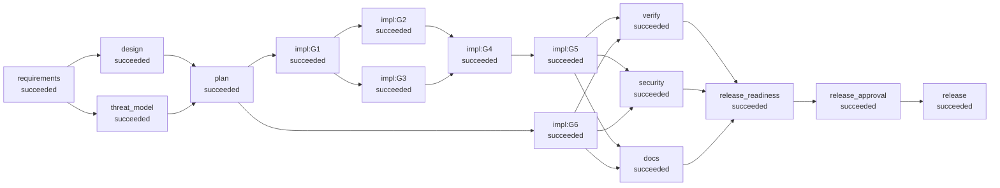

# Run report: greenfield (greenfield)

- **Run id:** `20260929-182946-greenfield-3ffd`
- **Status:** **succeeded**
- **Provider chain:** primary(fault-injected) -> scripted
- **Faults injected:** ['provider_outage']
- **End-to-end latency:** 4.019 s

## Requirement (as given)

```text
PRODUCT BRIEF: Link shortener (v1)

We need an internal HTTP service that turns long URLs into short links.

- A client POSTs a long URL and gets back a short code and the full short URL.
- Visiting /<code> redirects the browser to the original URL.
- Teams can optionally choose their own vanity code (e.g. /q3-report) instead of a random one.
- Links can optionally expire after a given number of seconds; expired links must stop redirecting.
- We want a click counter per link, and the ability to look a link up and delete it.
- Must expose health and readiness endpoints for the platform team.
- Only web links should be accepted (no javascript: or file: links).
- Short codes must not be guessable in sequence.
- Target: redirect handling under 50 ms p99 on a single node for 100 requests per second.
- Data must survive a restart. No external database for v1 - it has to run on a laptop.
```

## Normalised spec

**Goal:** HTTP service that creates, resolves, inspects and deletes short links, with optional vanity codes and expiry

**Flags:** []  |  **Vague terms detected:** []

**Functional**

- POST /api/v1/links accepts {url, custom_alias?, ttl_seconds?} and returns code, short_url, url, created_at, expires_at, click_count
- GET /{code} redirects to the destination and increments the link's click counter
- Custom aliases: 3-32 chars [A-Za-z0-9_-], reserved words rejected, duplicates rejected
- Links with ttl_seconds stop redirecting once expired (HTTP 410)
- GET /api/v1/links/{code} returns link metadata; DELETE removes it
- GET /healthz (liveness) and GET /readyz (readiness incl. schema version)

**Acceptance criteria**

- Creating a link returns 201 and the short URL redirects with the configured status to the original URL
- Duplicate custom alias returns 409; invalid alias or URL returns 422
- Expired link returns 410; unknown code returns 404
- Click count increases by one per successful redirect, with no lost updates under concurrency
- Schema migrations are idempotent across restarts
- All endpoints documented in a generated API reference

**Assumptions / clarifications**

- Should redirects be permanent (301/308) or temporary (302/307)? => 307
- Should DELETE hard-delete a link or tombstone it so the code is never reused? => hard-delete

**Out of scope**

- Authentication / multi-tenancy (internal network only in v1)
- Analytics beyond a total click counter
- Horizontal scaling

## Orchestration graph (final)



Parallel waves: `[['requirements'], ['design', 'threat_model'], ['plan'], ['impl:G1', 'impl:G6'], ['impl:G2', 'impl:G3'], ['impl:G4'], ['impl:G5'], ['docs', 'security', 'verify'], ['release_readiness'], ['release_approval'], ['release']]`

Critical path of implementation tasks: `['G1', 'G3', 'G4', 'G5']`

### Task decomposition

| Task | Title | Depends on | Scope | Risk | Proof (tests) |
|---|---|---|---|---|---|
| G1 | Domain model, errors and configuration | - | shortener/__init__.py, shortener/__main__.py, shortener/config.py, shortener/errors.py, shortener/models.py, … | low | tests/shortener/test_config_models.py |
| G6 | Declare runtime and test dependencies | - | requirements.txt | low |  |
| G2 | Code generation and URL validation | G1 | shortener/codegen.py, shortener/validation.py, tests/shortener/test_units.py | low | tests/shortener/test_units.py |
| G3 | Persistence layer and schema v1 | G1 | shortener/db.py, shortener/repository.py, tests/shortener/conftest.py, tests/shortener/test_persistence.py | medium | tests/shortener/test_persistence.py |
| G4 | Link service (business rules) | G2, G3 | shortener/link_service.py, tests/shortener/test_link_service.py | low | tests/shortener/test_link_service.py |
| G5 | HTTP API | G4 | shortener/app.py, shortener/schemas.py, tests/shortener/test_api.py | medium | tests/shortener/test_api.py |

## Execution timeline

| t+s | Event | Node | Detail |
|---|---|---|---|
|   0.00 | `run.started` |  |  |
|   0.00 | `node.started` | requirements |  |
|   0.00 | `approval.requested` | requirements | - Should redirects be permanent (301/308) or temporary (302/307)? (default: 307) - Should DELETE hard-delete a link or tombstone it so the code is never reused… |
|   0.00 | `approval.decided` | requirements | answer by avinash.kanna (recorded): Temporary redirects so we can change destinations and keep counting clicks. |
|   0.01 | `node.succeeded` | requirements | spec with 6 acceptance criteria; 2 clarifications |
|   0.01 | `node.started` | design |  |
|   0.01 | `node.started` | threat_model |  |
|   0.01 | `fallback.used` |  | simulated outage of primary provider for 'design' |
|   0.03 | `approval.requested` | design | 6 endpoints, 3 ADRs  files: ['docs/adr/ADR-001.md', 'docs/adr/ADR-002.md', 'docs/adr/ADR-003.md', 'docs/design/greenfield.md'] new files: ['docs/adr/ADR-001.md… |
|   0.03 | `approval.decided` | design | approve by avinash.kanna (recorded): Layering and SQLite choice are fine for v1; keep the repository interface swappable. |
|   0.12 | `node.succeeded` | threat_model | 7 threats identified, 4 residual |
|   0.21 | `node.succeeded` | design | 6 endpoints, 3 ADRs |
|   0.22 | `node.started` | plan |  |
|   0.22 | `fallback.used` |  | simulated outage of primary provider for 'plan' |
|   0.22 | `node.succeeded` | plan | 6 tasks, 4 waves |
|   0.22 | `graph.mutated` | plan | added=['impl:G1', 'impl:G6', 'impl:G2', 'impl:G3', 'impl:G4', 'impl:G5'] updated=[] removed=[] |
|   0.23 | `node.started` | impl:G1 |  |
|   0.23 | `node.started` | impl:G6 |  |
|   0.24 | `approval.requested` | impl:G6 | G6: 1 files  files: ['requirements.txt'] new files: ['requirements.txt'] detected actions: ['new_dependency'] |
|   0.24 | `approval.decided` | impl:G6 | approve by avinash.kanna (recorded): Dependencies are on the allowlist. |
|   0.33 | `node.succeeded` | impl:G6 | G6: 1 files |
|   0.61 | `node.succeeded` | impl:G1 | G1: 6 files |
|   0.61 | `node.started` | impl:G2 |  |
|   0.61 | `node.started` | impl:G3 |  |
|   0.91 | `approval.requested` | impl:G3 | G3: 4 files  files: ['shortener/db.py', 'shortener/repository.py', 'tests/shortener/conftest.py', 'tests/shortener/test_persistence.py'] new files: ['shortener… |
|   0.91 | `approval.decided` | impl:G3 | approve by avinash.kanna (recorded): Initial schema reviewed: links table, created_at index, no PII. |
|   1.00 | `node.succeeded` | impl:G3 | G3: 4 files |
|   1.10 | `node.succeeded` | impl:G2 | G2: 3 files |
|   1.11 | `node.started` | impl:G4 |  |
|   1.46 | `node.succeeded` | impl:G4 | G4: 2 files |
|   1.47 | `node.started` | impl:G5 |  |
|   2.22 | `approval.requested` | impl:G5 | G5: 3 files  files: ['shortener/app.py', 'shortener/schemas.py', 'tests/shortener/test_api.py'] new files: ['shortener/app.py', 'shortener/schemas.py', 'tests/… |
|   2.22 | `approval.decided` | impl:G5 | approve by avinash.kanna (recorded): Public API surface matches the signed-off design; error mapping centralised. |
|   2.31 | `node.succeeded` | impl:G5 | G5: 3 files |
|   2.32 | `node.started` | docs |  |
|   2.32 | `node.started` | security |  |
|   2.32 | `node.started` | verify |  |
|   2.37 | `node.succeeded` | security | findings {'high': 0, 'medium': 0, 'low': 0} |
|   2.82 | `node.succeeded` | docs | API reference for 6 endpoints; changelog 1.0.0 |
|   3.52 | `node.succeeded` | verify | 44 tests passed, 0 failed |
|   3.52 | `node.started` | release_readiness |  |
|   3.53 | `node.succeeded` | release_readiness | [PASS] all_tasks_implemented: 6 tasks [PASS] tests_green: 44 passed, 0 failed [PASS] api_contract: missing=[] [PASS] no_high_security_findings: {'high': 0, 'me… |
|   3.54 | `node.started` | release_approval |  |
|   3.54 | `approval.requested` | release_approval | [PASS] all_tasks_implemented: 6 tasks [PASS] tests_green: 44 passed, 0 failed [PASS] api_contract: missing=[] [PASS] no_high_security_findings: {'high': 0, 'me… |
|   3.54 | `approval.decided` | release_approval | approve by avinash.kanna (recorded): Readiness checklist green. Ship v1.0.0. |
|   3.54 | `node.succeeded` | release_approval | [PASS] all_tasks_implemented: 6 tasks [PASS] tests_green: 44 passed, 0 failed [PASS] api_contract: missing=[] [PASS] no_high_security_findings: {'high': 0, 'me… |
|   3.54 | `node.started` | release |  |
|   4.01 | `node.succeeded` | release | released 1.0.0 (067493d7cd) |
|   4.02 | `run.finished` |  | status=succeeded |

## Human checkpoints

| Checkpoint | Node | # | Decision | Approver | Comment |
|---|---|---|---|---|---|
| clarification | requirements | 1 | **answer** | avinash.kanna (recorded) | Temporary redirects so we can change destinations and keep counting clicks. |
| design_signoff | design | 1 | **approve** | avinash.kanna (recorded) | Layering and SQLite choice are fine for v1; keep the repository interface swappable. |
| change_review | impl:G6 | 1 | **approve** | avinash.kanna (recorded) | Dependencies are on the allowlist. |
| change_review | impl:G3 | 2 | **approve** | avinash.kanna (recorded) | Initial schema reviewed: links table, created_at index, no PII. |
| change_review | impl:G5 | 3 | **approve** | avinash.kanna (recorded) | Public API surface matches the signed-off design; error mapping centralised. |
| release | release_approval | 1 | **approve** | avinash.kanna (recorded) | Readiness checklist green. Ship v1.0.0. |

## Decisions and lineage

- **clarify:redirect-status** (human:avinash.kanna (recorded), requirements): Should redirects be permanent (301/308) or temporary (302/307)? -> 307
- **clarify:delete-semantics** (human:avinash.kanna (recorded), requirements): Should DELETE hard-delete a link or tombstone it so the code is never reused? -> hard-delete
- **spec:normalised** (agent, requirements): normalised requirement into 6 functional reqs, 6 acceptance criteria, flags=[]
- **threats:assessed** (agent, threat_model): 7 threats, 4 residual
- **ADR-001** (agent, design): SQLite behind a repository interface: Use SQLite (WAL) with versioned forward-only migrations, accessed only through LinkRepository.
- **ADR-002** (agent, design): Random base62 codes from a CSPRNG: 7-character codes drawn with secrets.choice over [A-Za-z0-9]; bounded retry on collision.
- **ADR-003** (agent, design): 307 Temporary Redirect: Redirect with 307 as chosen by the requester at clarification.
- **plan:decomposition** (agent, plan): 6 tasks in 4 waves; critical path ['G1', 'G3', 'G4', 'G5']
- **impl:G6** (agent, impl:G6): Declare runtime and test dependencies (1 files)
- **impl:G1** (agent, impl:G1): Domain model, errors and configuration (6 files)
- **impl:G3** (agent, impl:G3): Persistence layer and schema v1 (4 files)
- **impl:G2** (agent, impl:G2): Code generation and URL validation (3 files)
- **impl:G4** (agent, impl:G4): Link service (business rules) (2 files)
- **impl:G5** (agent, impl:G5): HTTP API (3 files)
- **security:scan** (agent, security): findings {'high': 0, 'medium': 0, 'low': 0}
- **verify:result** (agent, verify): 44 passed / 0 failed; contract missing=[]
- **release:readiness** (agent, release_readiness): ready=True version=1.0.0
- **release:promoted** (agent, release): promoted 067493d7cd to release

Lineage of the release decision:

```text
- decision release:readiness by agent @ release_readiness: ready=True version=1.0.0
  - verification (from verify run 1, hash ea4729c603511bb6)
    - design (from design run 1, hash 26d51b5b41b1be21)
      - spec (from requirements run 1, hash bdb7936c958a74c5)
        - requirement (from human:product-owner run 1, hash f18a223549f49431)
        - amendments (from engine run 0, hash 4f53cda18c2baa0c)
        - clarification_answers (from requirements run 1, hash 3a6ee2d040016ea3)
  - security (from security run 1, hash b5fb0dbf5a562fca)
  - docs (from docs run 1, hash a9677dc16bc6cd01)
    - plan (from plan run 1, hash 809c5fb73045a4c0)
      - threats (from threat_model run 1, hash 7bf1e2d6639a16b3)
```

## Validation

- Tests: 44 passed, 0 failed (1.19 s)
- API contract: missing=[], undeclared=[]
- Security findings: {'high': 0, 'medium': 0, 'low': 0}
- Residual threats: ['T4', 'T5', 'T6', 'T7']

| Readiness check | Result | Detail |
|---|---|---|
| all_tasks_implemented | PASS | 6 tasks |
| tests_green | PASS | 44 passed, 0 failed |
| api_contract | PASS | missing=[] |
| no_high_security_findings | PASS | {'high': 0, 'medium': 0, 'low': 0} |
| docs_generated | PASS | docs/API.md |
| version_bumped | PASS | None -> 1.0.0 |
| no_rejected_checkpoints | PASS | 5 checkpoint decisions so far |

## Reliability metrics

| Metric | Value |
|---|---|
| status | succeeded |
| end_to_end_latency_s | 4.019 |
| nodes_total | 16 |
| nodes_succeeded | 16 |
| nodes_failed | 0 |
| node_success_rate | 1.0 |
| attempts_total | 16 |
| attempt_success_rate | 1.0 |
| retries | 0 |
| retry_frequency | 0.0 |
| rollbacks | 0 |
| fallbacks | 2 |
| policy_violations | 0 |
| replans | 0 |
| approvals | 6 |
| approval_wait_s | 0.0 |
| incidents_recovered | 0 |
| incidents_unrecovered | 0 |
| mttr_s | None |
| stage_latency_s | {'design': 0.318, 'docs': 0.502, 'implement': 2.566, 'plan': 0.006, 'release': 0.475, 'requirements': 0.004, 'verify': 1.243} |

## Workspace commits (checkpoints)

```text
b5f606f8ce baseline: empty workspace
967376ef71 baseline: project scaffold (pytest config)
fd1b431107 [threat_model] 7 threats identified, 4 residual
9be4a10fec [design] 6 endpoints, 3 ADRs
c15f69156c [impl:G6] G6: 1 files
efc9483940 [impl:G1] G1: 6 files
ba4a536755 [impl:G3] G3: 4 files
3dbd5d4a52 [impl:G2] G2: 3 files
dbbb531ba6 [impl:G4] G4: 2 files
50b86a4924 [impl:G5] G5: 3 files
067493d7cd [docs] API reference for 6 endpoints; changelog 1.0.0
```

Audit trail: `audit.jsonl` (hash-chained). Artifacts: `artifacts/`. Released tree: `release/`.
